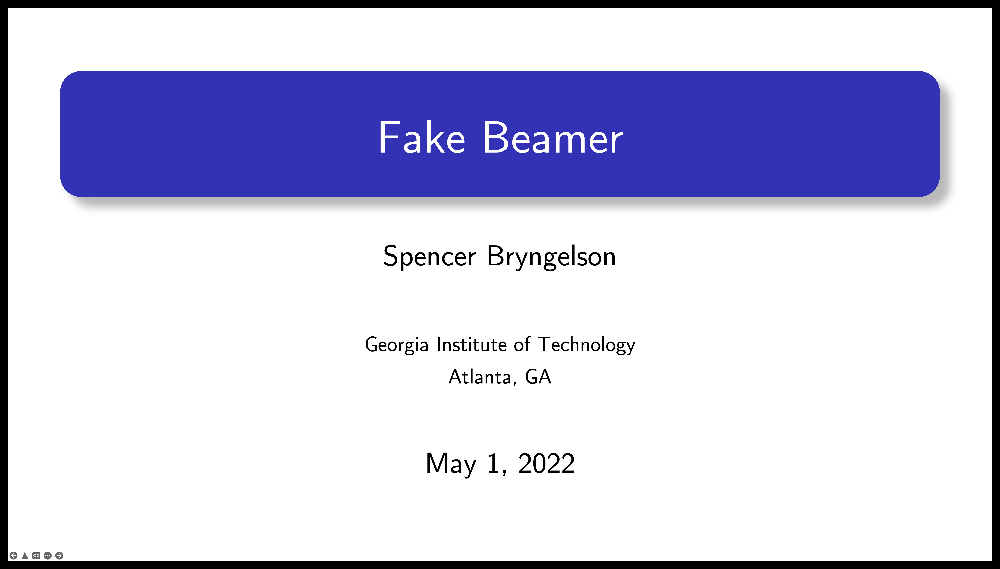
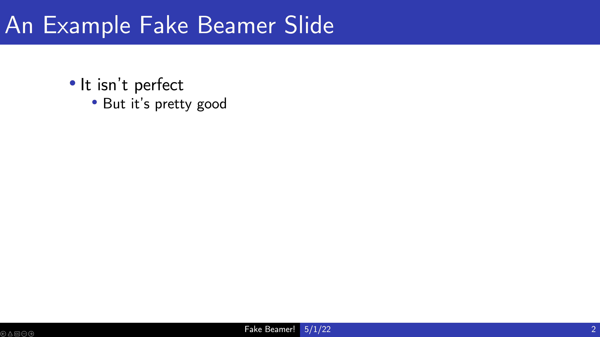

# Fake Beamer

[](https://github.com/sbryngelson/Fake-Beamer/actions/workflows/validate-office-packages.yml)

You like Beamer but need to use PowerPoint? Fake Beamer is for you!





## Quick start

1. Install the bundled Computer Modern fonts from `computer-modern-fonts/`.
2. Open `example.pptx` directly, or install `fake-beamer.potx` as a PowerPoint template.
3. If you want the classic Beamer-style footer, enable it from `Insert`, `Header & Footer`.
4. To change the Beamer blue, edit the theme color named `Accent 1`.

## Included files

- `fake-beamer.thmx`: PowerPoint theme file.
- `fake-beamer.potx`: PowerPoint template file.
- `example.pptx`: Example presentation using the template.
- `computer-modern-fonts/`: Bundled Computer Modern Unicode 0.7.0 fonts under the Open Font License.
- `images/`: Preview images used in this README.

## Disclaimer

I don't fully appreciate (read: understand) Microsoft PowerPoint.
This template has undergone only mild testing via my Mac (Monterey) and a Windows 11 VM.
I suspect there to be some bugs, particularly associated with the required fonts.

## How to use

### Install theme or template

You can properly install this as what Microsoft calls a "Theme" using the `fake-beamer.thmx` file.
The `fake-beamer.potx` file is the "Template" file.
I do not grok the difference between these, but both should work.
You should also be able to just use the example presentation, `example.pptx`.

### Install Computer Modern fonts

What would Fake Beamer be without _Computer Modern_ fonts?!
They are so important, I even included them in the repository, `computer-modern-fonts/`.
You should install them.
Learn to do this [here](https://support.apple.com/en-us/HT201749) (Mac) or [here](https://www.lifewire.com/install-fonts-in-windows-11-5192443) (Windows).
The bundled font source and version are documented in `docs/bundled-fonts.md`.

### Enable Header \& Footer

The classic Beamer footer can only be seen by enabling "Headers \& Footers"!
Do this via `Insert`, `Header & Footer` and then fill out as appropriate.

### I don't like the classic Beamer Blue!

I don't really like it either, but it's the Beamer hallmark.
In either case, you can change that bright blue to something else by selecting all your slides, then (on Mac) `Format`, `Theme Colors`.
Then you can change `Accent 1` to your favorite color.
You can also change the font colors.
The other named colors are not used by the theme.

## Contribute

Git isn't built for such PowerPoint files, but I appreciate comments via Issues.
I also will accept fixes via Pull Requests if you can explain them well.
See `CONTRIBUTING.md` for the expected edit, test, and review workflow.

You can inspect the Office packages from the command line with:

```sh
scripts/inspect-office-files.sh
```

## License

MIT. The CM fonts are licensed under the terms of Open Font License.
