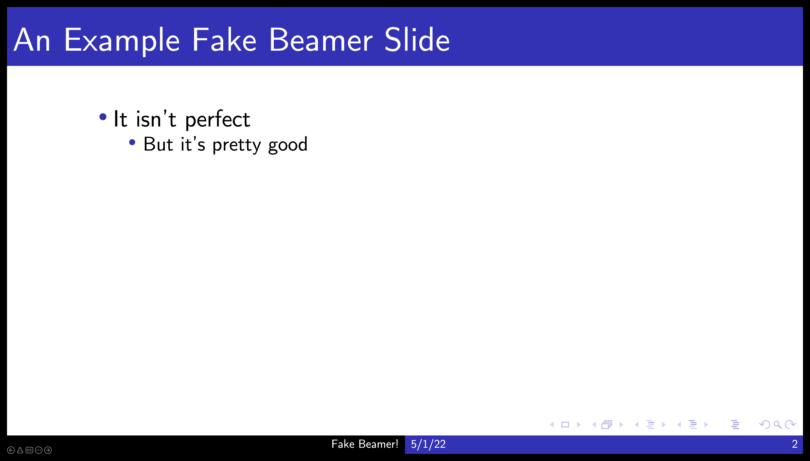

# PPT-Beamer (aka Fake Beamer)

You like Beamer but need to use PowerPoint? Fake Beamer is for you!

  

(don't worry, those icons in the bottom left are only visable on the presenter's screen)

## Disclaimer

I don't fully appreciate (read: understand) Microsoft PowerPoint.
This template and theme have undergone only mild testing via my Mac (Monterrey) and a Windows 11 VM.
I suspect there to be some bugs, particularly associated with the required fonts.

## How to use

### Install theme or template

You can properly install this as what Microsoft calls a "Theme" using the `fake-beamer.thmx` file.
The `fake-beamer.potx` file is the "Template" file.
I do not grok the difference between these, but both should work.
You should also be able to just use the example presentation, `example.pptx`.

### Install Computer Modern fonts

What would a Fake Beamer be without appropriate _Computer Modern_ fonts?!
They are so important, I even included them in the repository. 
You should install them.
Learn to do this [here](https://support.apple.com/en-us/HT201749) (Mac) or [here](https://www.lifewire.com/install-fonts-in-windows-11-5192443) (Windows).

### Enable Header \& Footer

The classic Beamer footer can only be seen by enabling "Headers \& Footers"!
Do this via `Insert`, `Header \& Footer` and then fill out as appropriate. 

### I don't like the classic Beamer Blue!

I don't really like it either, but it's the Beamer hallmark. 
In either case, you can change that bright blue to something else by selecting all your slides, then (on Mac) `Format`, `Theme Colors`. 
Then you can change `Accent 1` to your favorite color.
You can also change the font colors. 
The other named colors are not used by the theme.

## Contribute

Git isn't built for such PowerPoint files, but I appreciate comments via Issues.
I also will accept fixes via Pull Requests, if you can explain them well.

## License

MIT
